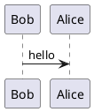
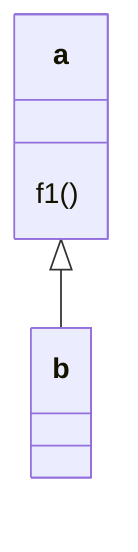

# First page


```plantuml
@startuml
Bob -> Alice : hello
@enduml
```

---

## Second page

```sequence
Bob -> Alice : hello
```

---

## 3rd page: class diagram


```mermaid
classDiagram

a <|-- b

class a{
   f1()
}
```

